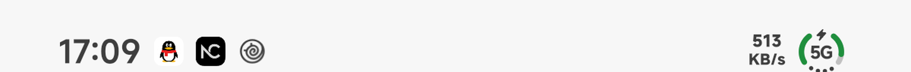
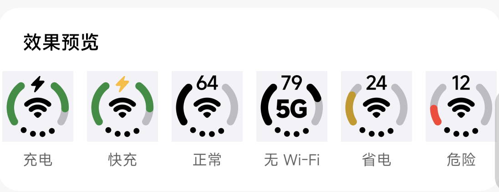
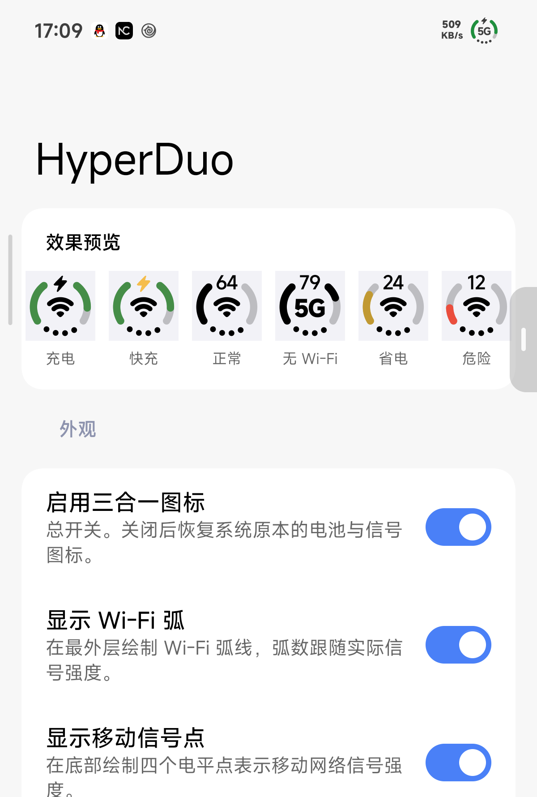

# HyperDuo

把状态栏里的 **Wi-Fi、移动信号、电量** 合并成一个仿 iPhone「Duo」风格的三合一图标。



HyperDuo 是一个 LSPosed 模块，只作用于系统界面（`com.android.systemui`）。开启后，状态栏
右上角原本分开的 Wi-Fi 图标、信号格与电池图标会被替换成一个整体字形：

- 外圈是**电池环**，缺口在下方，按电量点亮；
- 环里是 **Wi-Fi 弧线**，弧数跟随真实信号强度；
- 底部是**移动信号点**，四个点表示移动网络信号强度；
- 环内是**电量数字**，充电时变成闪电（快充为琥珀色闪电）。

所有元素都能单独开关，尺寸、颜色也可以按自己的状态栏习惯微调，改完**立即生效**，无需重启。

## 效果预览



从左到右：充电、快充、正常、无 Wi-Fi（显示网络类型）、省电、危险。这套预览也内置在设置
界面顶部，会跟着你的设置实时变化。

## 安装

### 前置条件

| 项目 | 要求 |
| --- | --- |
| 系统 | HyperOS / MIUI（已在 HyperOS 4 上完整验证） |
| Android | 10 及以上（API 29+） |
| 框架 | 支持 libxposed **API 102** 的 LSPosed，例如 LSPosed 2.2.0-it（7890） |

### 步骤

1. 从 [Releases](https://github.com/yixing233/HyperDuo/releases) 下载最新的 `HyperDuo-*.apk`
   并安装。
   > 如果 Releases 里还没有可用安装包，可以按 [开发文档](docs/DEVELOPMENT.md) 自行构建。
2. 打开 **LSPosed 管理器** → 模块 → 启用 **HyperDuo**。
3. 在模块的作用域里勾选 **系统界面（`com.android.systemui`）**。
4. 重启系统界面让模块生效：可以在 LSPosed 里点「重启作用域」，或者重启手机。

重启系统界面也可以直接用命令：

```sh
adb shell "su -c 'killall com.android.systemui'"
```

### 打开设置

安装后桌面会出现 **HyperDuo** 图标，点开即可；也可以在 LSPosed 管理器里点击模块进入。

设置界面顶部的「关于」卡片会显示是否已经连上框架：

| 状态 | 含义 |
| --- | --- |
| **已连接框架** | 模块已获得框架服务，设置修改会立即生效。 |
| **未连接框架服务** | 请确认模块已在 LSPosed 中启用，并且勾选了作用域。 |

## 设置说明



### 外观

| 设置项 | 说明 | 默认 |
| --- | --- | --- |
| 启用三合一图标 | 总开关。关闭后恢复系统原本的电池与信号图标。 | 开 |
| 显示 Wi-Fi 弧 | 在最外层绘制 Wi-Fi 弧线，弧数跟随实际信号强度。 | 开 |
| 显示移动信号点 | 在底部绘制四个电平点表示移动网络信号强度。 | 开 |
| 显示电量数字 | 在环内显示电量百分比；充电时改为闪电图标。 | 开 |
| 充电时显示闪电 | 关闭后充电时仍显示电量数字。 | 开 |
| 显示网络类型 | 无 Wi-Fi 时在圆环中间显示 3G / 4G / 5G 等网络类型，电量数字回到顶部。 | 关 |

### 尺寸

| 设置项 | 说明 | 默认 | 范围 |
| --- | --- | --- | --- |
| 环线粗细 | 电池圆环的描边宽度。 | 14 | 4 – 16 |
| 弧线粗细 | Wi-Fi 弧线的描边宽度。 | 12 | 3 – 16 |
| 数字字号 | 电量百分比文字的尺寸。 | 36 | 16 – 44 |
| 数字字重 | 电量数字的笔画粗细，100 最细、900 最粗。 | 700 | 100 – 900 |
| 网络类型字号 | 圆环中间 3G / 4G / 5G 等文字的大小。 | 32 | 16 – 44 |
| 网络类型字重 | 网络类型的笔画粗细，100 最细、900 最粗。 | 700 | 100 – 900 |
| 底纹浓度 | 未点亮部分的透明度。 | 56 | 0 – 255 |

### 颜色

| 设置项 | 说明 | 默认 |
| --- | --- | --- |
| 状态颜色 | 分别为低电量、充电与危险电量指定颜色。关闭后统一使用状态栏前景色。 | 开 |
| 低电量阈值 | 电量低于该值时切换到低电量颜色。 | 20（可调 5 – 50） |
| 低电量颜色 | 电量处于低电量阈值以内时使用。 | 深色底 `#F2B900` / 浅色底 `#C99700` |
| 充电颜色 | 正在充电时使用。 | 深色底 `#34C759` / 浅色底 `#1F8F3D` |
| 危险电量颜色 | 电量过低时使用，优先级最高。 | `#FF3B30` |

三种状态颜色都可以**分别**为深色背景和浅色背景设置一套，点按条目就能选择。灯环的底纹和未
激活的信号点会跟随状态栏本身的前景色，所以换主题、开深色模式都能自动适配。

颜色的优先级是：**危险电量 → 低电量 / 省电 → 充电 → 前景色**。

### 高级

| 设置项 | 说明 | 默认 |
| --- | --- | --- |
| 调试日志 | 把详细过程写入 LSPosed 日志，排查问题时开启。 | 关 |
| 恢复默认 | 把三种状态颜色恢复为出厂预设。 | — |

## 常见问题

**改完设置需要重启系统界面吗？**

不需要。模块通过框架的远程配置通道实时接收变更，改完立刻重绘。

**状态栏完全没有变化？**

依次确认：模块已在 LSPosed 中启用 → 作用域勾选了「系统界面」→ 已经重启过系统界面。三者都
满足后仍然无效，请检查手机上是否还有别的状态栏类模块在同时改动同一区域。

**状态栏图标还是原样，但设置里显示「已连接框架」？**

框架连接正常说明模块进程在跑，问题通常出在作用域——没有勾选 `com.android.systemui` 时模块
不会被注入到系统界面里。

**「关了 Wi-Fi 弧还在」？**

不会。Wi-Fi 的**有无**有实时采样兜底，关掉 Wi-Fi 后弧线会消失。但 Wi-Fi 的**信号等级**依赖
系统界面内部的资源名解析，个别固件改走别的绑定路径时，弧线可能只显示为不点亮（不会崩溃）。

**切换「显示移动信号点」后没有马上变化？**

移动信号点只在信号等级变化时刷新。这是已知限制：系统界面在移动视图淡出后仍报告「可见」，
模块无法从中判断开关状态，所以需要等下一次信号变化（或重启系统界面）才会完全同步。

**字号调大后字形被裁切了？**

系统给电池图标预留的区域是固定的（28dp × 20dp），几何参数只改变绘制内容，不会改变预留尺寸。
极端值下字形可能超出可用范围，调小一点即可。

**支持哪些机型和系统？**

目前只在 **小米 14 · HyperOS 4 · Android 17（API 37）** 上做过完整验证。HyperOS / MIUI 的其他
机型与版本理论可用，但状态栏内部实现不同时，对应功能会自动跳过并写下日志，不会崩溃。

## 排查问题

设置里打开「调试日志」后，可以这样观察模块输出：

```powershell
adb logcat -v time -s LSPosedFramework:* | Select-String HyperDuo
```

- 日志的 tag 是 **`LSPosedFramework`**（由框架代打），**不是** `HyperDuo`。
- 启动时会打印一行 `HyperDuo installed, hooks=8`；某个功能没生效时会打印
  `skip <id>: method not found`，说明当前系统的实现和模块的预期不一致。

## 开发

构建方式、模块架构、注入点、几何与配色实现、Hook 清单等技术细节都在
[**docs/DEVELOPMENT.md**](docs/DEVELOPMENT.md)。

## 致谢

- 视觉参考：[status-trio](https://github.com/lingyired/status-trio)（iPhone Duo 风格状态栏图标）。
- 设置界面参考：[HyperCopy](https://github.com/1812z/HyperCopy)；界面基于 Compose +
  [Miuix](https://github.com/miuix-kotlin-multiplatform/miuix) 实现 MIUI 风格。
